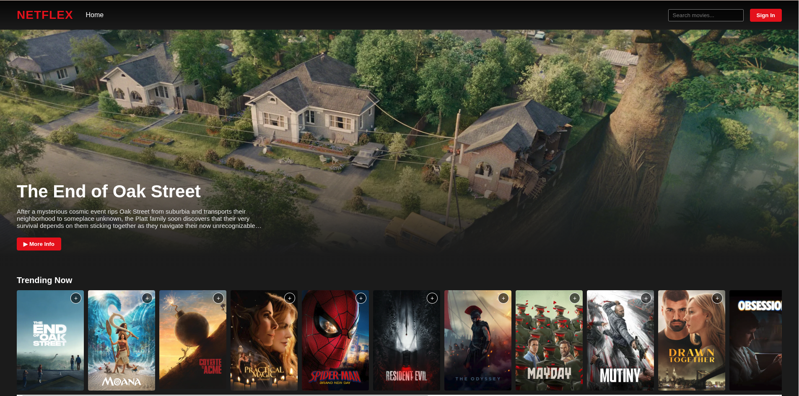
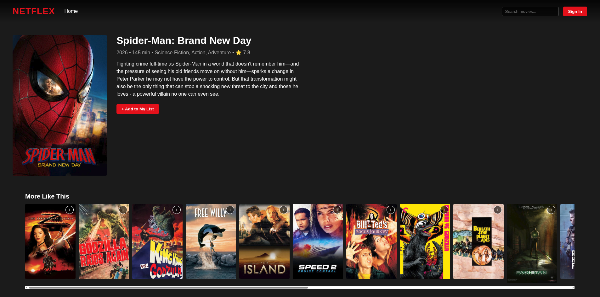
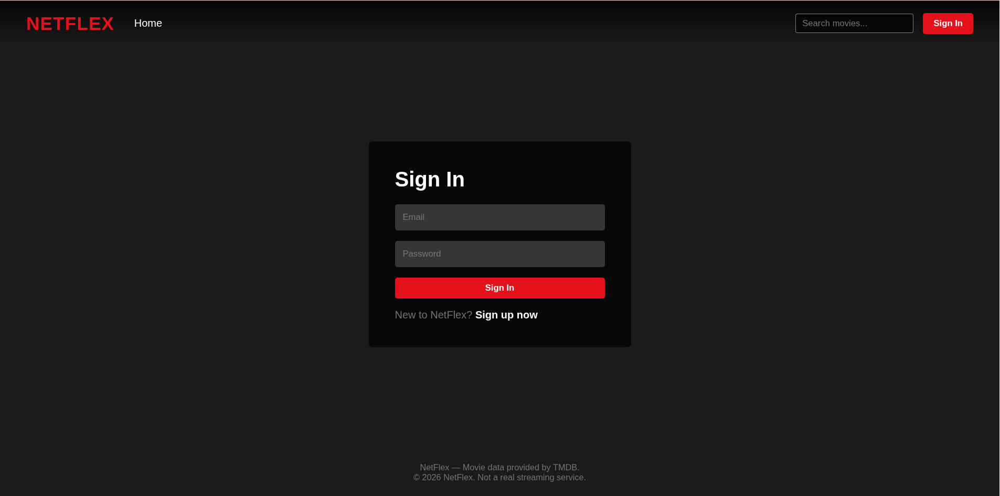
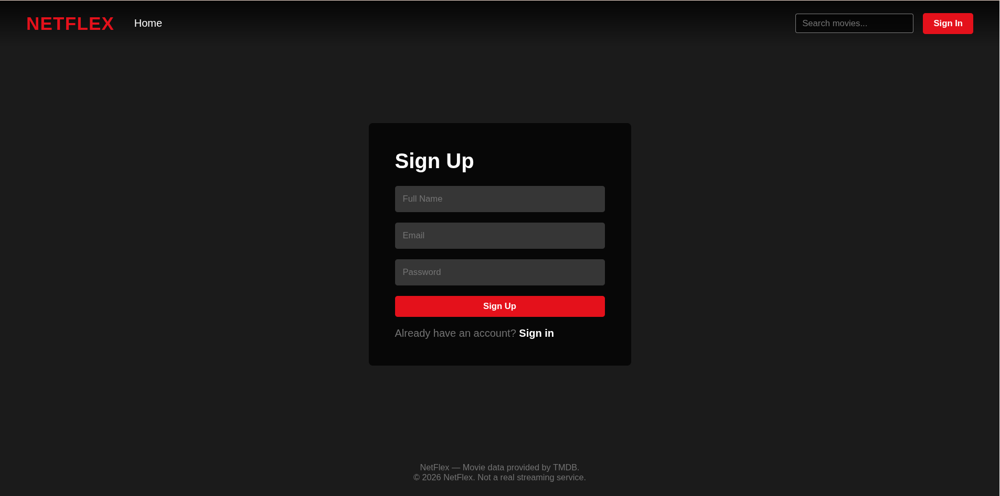

<div align="center">


### Discover your next favorite movie

A responsive movie discovery app powered by React, Express, MongoDB, and TMDB.

<p>
  <a href="#features">Features</a> ·
  <a href="#screenshots">Screenshots</a> ·
  <a href="#getting-started">Getting started</a> ·
  <a href="#api-surface">API surface</a>
</p>


</div>

## Features

- Browse trending, popular, top-rated, and upcoming movies
- Search movies and view details, similar titles, posters, and backdrops
- Create an account with email OTP verification
- Secure cookie-based authentication with protected routes
- Save and manage a personal watchlist
- Update profile details and manage sessions
- Responsive interface for desktop and mobile screens

## Screenshots

<div align="center">

| Home | Movie details |
|:---:|:---:|
|  |  |

| Login | Register |
|:---:|:---:|
|  |  |

</div>

## Tech stack

| Layer | Tools |
| --- | --- |
| Frontend | React, React Router, Axios, Vite |
| Backend | Node.js, Express, ES modules |
| Data | MongoDB, Mongoose |
| Authentication | JWT, HTTP-only cookies, bcryptjs |
| Email | Nodemailer with Gmail SMTP |
| Movie data | The Movie Database (TMDB) API |
| Protection | CORS and express-rate-limit |

## Getting started

### 1. Install dependencies

```bash
cd client && npm install
cd ../server && npm install
```

### 2. Configure the server

Create `server/.env` from `server/.env.example`:

```env
PORT=3000
DB_URL=your-mongodb-connection-string
JWT_SECRET=your-long-random-secret
EMAIL_USER=your-email@example.com
EMAIL_PASS=your-gmail-app-password
TMDB_API_KEY=your-tmdb-api-key
TMDB_BASE_URL=https://api.themoviedb.org/3
```

Make sure your MongoDB provider allows your current IP address. Gmail requires an app password for SMTP.

### 3. Configure the client

Create or update `client/.env`:

```env
VITE_API_URL=http://localhost:3000/api
```

### 4. Run both apps

Terminal 1:

```bash
cd server
npm run dev
```

Terminal 2:

```bash
cd client
npm run dev
```

Open [http://localhost:5173](http://localhost:5173).

<details>
<summary><strong>Production client build</strong></summary>

```bash
cd client
npm run build
npm run preview
```

</details>

## API surface

| Area | Endpoints |
| --- | --- |
| Auth | `/api/auth/register`, `/login`, `/verify-email`, `/logout` |
| Movies | `/api/movies/trending`, `/popular`, `/top-rated`, `/upcoming`, `/search` |
| Watchlist | `/api/watchlist` |
| Users | `/api/users/profile` |

## Project structure

```text
client/   React + Vite frontend
server/   Express API + MongoDB backend
ScreenShots/  README product screenshots
```

## Credits

Movie data and imagery are provided by [TMDB](https://www.themoviedb.org/). NetFlex is a learning project and is not affiliated with Netflix or TMDB.


